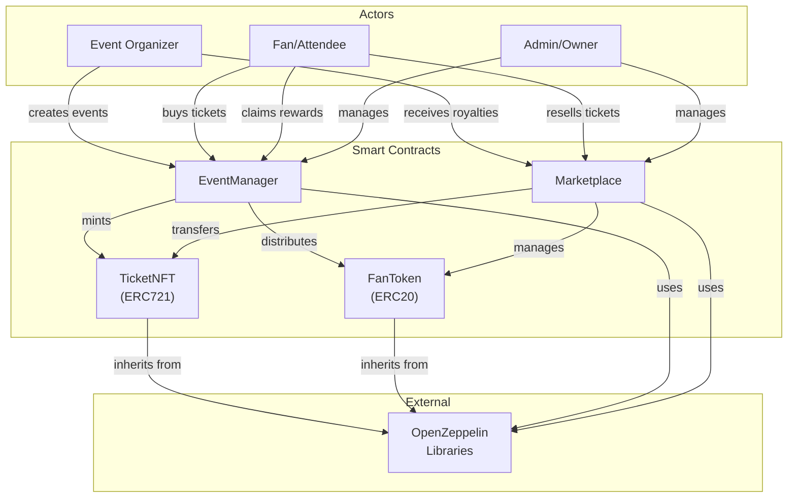
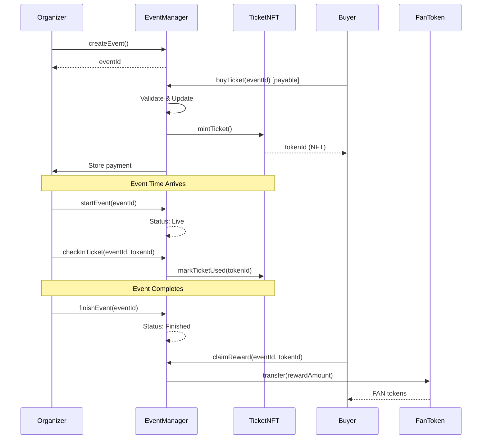
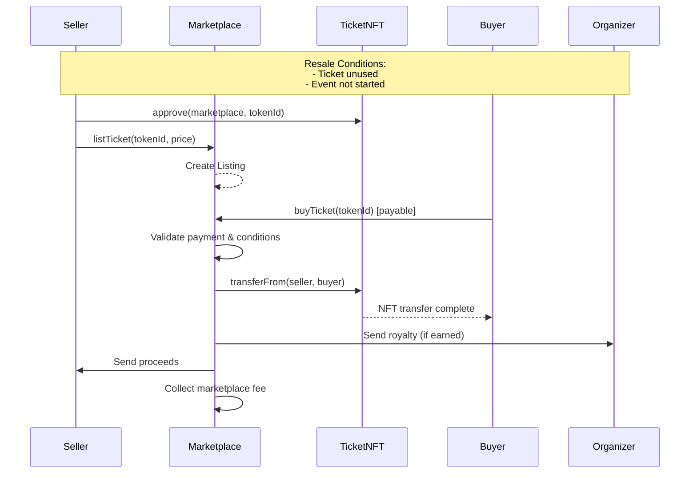
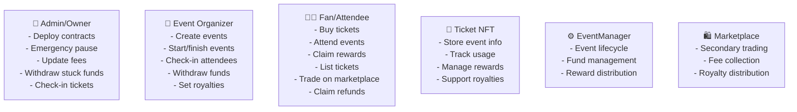
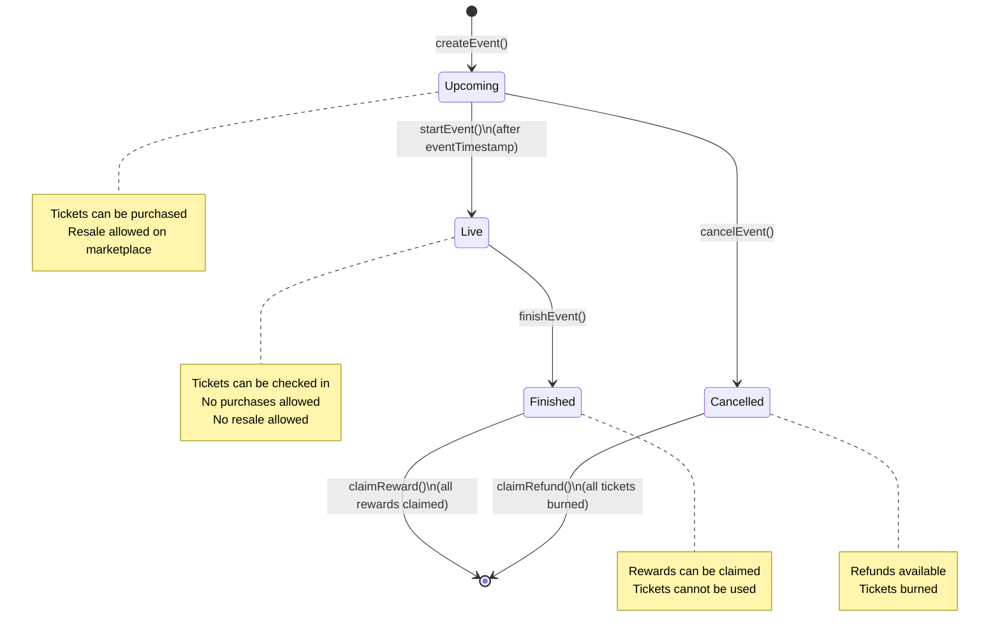

# NFT Ticket Marketplace

A decentralized, blockchain-based ticketing system for sports events and live experiences. Built on Ethereum with NFT-based tickets, enabling transparent event management, secure ownership transfer, and reward mechanisms.

---

## 🎯 Overview

NFT Ticket Marketplace is a comprehensive solution for event organizers and fans, combining the benefits of blockchain technology with the practical needs of modern ticketing:

- **NFT-Based Tickets**: Each ticket is an ERC721 NFT with unique metadata
- **Event Management**: Create, manage, and monitor events on-chain
- **Secondary Marketplace**: Enable fan-to-fan ticket trading (resale)
- **Reward System**: Distribute FanToken rewards to attendees after events
- **Royalty Mechanism**: Event organizers earn from secondary sales
- **Security Features**: Pausable contracts, reentrancy guards, and access controls

---

## 🏗️ Architecture



---

## 📋 System Components

### 1. **FanToken (ERC20)**
Reward token distributed to ticket holders after event completion.

**Key Features:**
- Total supply: 1,000,000 tokens
- Mintable by owner for additional distributions
- Used as reward mechanism for attendees

**File:** [contracts/FanToken.sol](contracts/FanToken.sol)

---

### 2. **TicketNFT (ERC721URIStorage)**
NFT representation of event tickets with royalty support.

**Key Features:**
- ERC721 standard compliance with URI storage
- ERC2981 royalty standard support
- Pausable functionality for emergency stops
- Ticket lifecycle tracking (used/unused, reward claimed)
- Unique token ID per ticket

**Structures:**
```solidity
struct TicketInfo {
    uint256 eventId;        // Reference to event
    bool used;              // Check-in status
    bool rewardClaimed;     // Reward claim status
}
```

**File:** [contracts/TicketNFT.sol](contracts/TicketNFT.sol)

---

### 3. **EventManager**
Core contract managing event lifecycle, ticket sales, and reward distribution.

**Key Features:**
- Event creation with customizable parameters
- Ticket purchasing with ETH
- Check-in system for event validation
- Refund mechanism for cancelled events
- Reward claiming after event completion
- Resale eligibility control
- Organizer fund withdrawal

**Event Lifecycle:**
```
Upcoming → Live → Finished
   ↓
Cancelled → (Refunds available)
```

**Structures:**
```solidity
struct EventDetails {
    string name;
    string metadataURL;
    address organizer;
    uint96 royaltyFee;      // In basis points (10,000 = 100%)
    uint256 ticketPrice;    // In Wei
    uint256 maxTickets;
    uint256 ticketsSold;
    uint256 eventTimestamp;
    EventStatus status;
    bool exists;
}
```

**File:** [contracts/EventManager.sol](contracts/EventManager.sol)

---

### 4. **Marketplace**
Secondary marketplace for ticket trading between fans.

**Key Features:**
- List unused tickets for resale
- Dynamic price updates
- Resale validation (unused tickets only, event not started)
- Automated royalty distribution
- Marketplace fee collection (2.5% default, max 10%)
- Secure fund transfers

**Listing Structure:**
```solidity
struct Listing {
    address seller;
    uint256 price;
    bool active;
}
```

**File:** [contracts/Marketplace.sol](contracts/Marketplace.sol)

---

## 🔄 Event & Ticket Flow



---

## 🛒 Marketplace Flow



---

## 🚀 Quick Start

### Prerequisites
- Node.js v16+
- npm or yarn
- Hardhat
- Solidity 0.8.24

### Installation

```bash
# Clone repository
git clone <repository-url>
cd Nft-ticket

# Install dependencies
npm install

# Create .env file
cp .env.example .env
```

### Environment Variables (.env)

```env
# Sepolia Testnet
SEPOLIA_RPC_URL=https://sepolia.infura.io/v3/YOUR_PROJECT_ID
PRIVATE_KEY=your_private_key_here
ETHERSCAN_API_KEY=your_etherscan_api_key
```

### Compilation

```bash
# Compile smart contracts
npx hardhat compile

# Get contract sizes
npx hardhat size-contracts
```

### Testing

```bash
# Run all tests
npx hardhat test

# Run specific test file
npx hardhat test test/TicketNFT.test.js

# Run with gas reporting
REPORT_GAS=true npx hardhat test
```

### Deployment

```bash
# Deploy to Sepolia Testnet
npx hardhat run scripts/deploy.js --network sepolia

# Verify contracts on Etherscan
npx hardhat verify --network sepolia <CONTRACT_ADDRESS> <CONSTRUCTOR_ARGS>
```

---

## 📝 Usage Examples

### Create an Event

```javascript
const eventName = "World Cup Final 2026";
const metadataURL = "ipfs://QmYourMetadataHash";
const ticketPrice = ethers.parseEther("0.5");  // 0.5 ETH
const maxTickets = 1000;
const eventTimestamp = Math.floor(Date.now() / 1000) + 86400 * 7;  // 7 days from now
const royaltyFee = 500;  // 5% in basis points

const tx = await eventManager.createEvent(
    eventName,
    metadataURL,
    ticketPrice,
    maxTickets,
    eventTimestamp,
    royaltyFee
);

const receipt = await tx.wait();
const eventId = receipt.events[0].args.eventId;
console.log(`Event created with ID: ${eventId}`);
```

### Purchase a Ticket

```javascript
const eventId = 1;
const tx = await eventManager.buyTicket(eventId, {
    value: ethers.parseEther("0.5")  // Must match ticket price
});

const receipt = await tx.wait();
const tokenId = receipt.events[0].args.tokenId;
console.log(`Ticket purchased with token ID: ${tokenId}`);
```

### Check In at Event

```javascript
const eventId = 1;
const tokenId = 101;

// Only organizer or admin can check in
const tx = await eventManager.checkInTicket(eventId, tokenId);
await tx.wait();
console.log("Ticket checked in successfully");
```

### List Ticket on Marketplace

```javascript
const tokenId = 101;
const listPrice = ethers.parseEther("0.6");  // 0.6 ETH

// Approve marketplace to transfer ticket
await ticketNFT.approve(marketplace.address, tokenId);

// Create listing
const tx = await marketplace.listTicket(tokenId, listPrice);
await tx.wait();
console.log(`Ticket listed at ${listPrice.toString()} Wei`);
```

### Buy on Secondary Market

```javascript
const tokenId = 101;
const listingPrice = ethers.parseEther("0.6");

const tx = await marketplace.buyTicket(tokenId, {
    value: listingPrice
});

await tx.wait();
console.log("Ticket purchased from marketplace");
```

### Claim Rewards After Event

```javascript
const eventId = 1;
const tokenId = 101;

// Only after event is finished
const tx = await eventManager.claimReward(eventId, tokenId);
await tx.wait();
console.log("Reward claimed successfully");
```

---

## 🔒 Security Features

### Contract-Level Security

| Feature | Implementation | Purpose |
|---------|-----------------|---------|
| **Reentrancy Protection** | `ReentrancyGuard` | Prevents reentrancy attacks in fund transfers |
| **Pausable Functions** | `Pausable` | Emergency stop mechanism for all critical functions |
| **Access Control** | `Ownable`, modifiers | Restricts functions to authorized addresses |
| **Input Validation** | Comprehensive checks | Prevents invalid states and parameters |
| **State Verification** | Pre-condition checks | Ensures valid state transitions |
| **Royalty Standard** | ERC2981 | Standard-compliant royalty implementation |

### Key Safety Checks

```solidity
// Validate event exists and is in correct state
modifier eventExists(uint256 eventId) {
    require(events[eventId].exists, "Invalid event");
    _;
}

// Prevent reentrancy in payment functions
function withdrawOrganizerFunds(uint256 eventId)
    external
    nonReentrant
    onlyOrganizer(eventId)
{
    // Safe transfer pattern using .call
    (bool success, ) = payable(msg.sender).call{value: amount}("");
    require(success, "Transfer failed");
}

// Validate resale conditions
function listTicket(uint256 tokenId, uint256 price)
    external
    whenNotPaused
{
    require(ticketNFT.ownerOf(tokenId) == msg.sender, "Not owner");
    require(!used, "Cannot resell used tickets");
    require(eventManager.isResaleAllowed(eventId), "Resale not allowed");
    require(approved, "Marketplace not approved");
}
```

### Best Practices Implemented

- ✅ **Checks-Effects-Interactions Pattern**: State changes before external calls
- ✅ **Pull Over Push**: Users withdraw funds rather than contracts pushing
- ✅ **Function Visibility**: Explicitly set to `external`, `public`, or `internal`
- ✅ **Error Handling**: Custom errors for gas efficiency
- ✅ **Event Logging**: Comprehensive event emissions for tracking

---

## 📊 Contract Sizes & Gas Optimization

```
FanToken:        ~3 KB
TicketNFT:       ~8 KB
EventManager:    ~15 KB
Marketplace:     ~12 KB
```

**Optimization Techniques:**
- Solidity optimizer enabled (runs: 200)
- Custom errors instead of require strings
- Efficient storage packing
- Minimal state variables

---

## 🧪 Test Coverage

### TicketNFT Tests ([test/TicketNFT.test.js](test/TicketNFT.test.js))
- Ticket minting and metadata
- Royalty configuration
- Ticket usage marking
- Reward claim tracking
- Ticket burning
- Pause/unpause functionality

### EventManager Tests ([test/EventManager.test.js](test/EventManager.test.js))
- Event creation and validation
- Ticket purchase flow
- Check-in functionality
- Refund mechanism for cancelled events
- Reward distribution
- Organizer fund withdrawal
- Event state transitions

### Marketplace Tests ([test/Marketplace.test.js](test/Marketplace.test.js))
- Listing creation and validation
- Price updates
- Resale conditions
- Purchase flow
- Royalty distribution
- Marketplace fee collection
- Listing cancellation

### Running Tests

```bash
# Run all tests
npx hardhat test

# Run with coverage
npx hardhat coverage

# Run single test suite
npx hardhat test test/EventManager.test.js

# Run tests with verbose output
npx hardhat test --verbose
```

---

## 📋 API Reference

### EventManager Key Functions

#### Event Management
| Function | Parameters | Returns | Access |
|----------|-----------|---------|--------|
| `createEvent()` | name, metadataURL, ticketPrice, maxTickets, eventTimestamp, royaltyFee | eventId | Public |
| `startEvent(eventId)` | eventId | - | Organizer |
| `finishEvent(eventId)` | eventId | - | Organizer |
| `cancelEvent(eventId)` | eventId | - | Organizer/Owner |

#### Ticket Operations
| Function | Parameters | Returns | Access |
|----------|-----------|---------|--------|
| `buyTicket(eventId)` | eventId | tokenId | Public (payable) |
| `checkInTicket(eventId, tokenId)` | eventId, tokenId | - | Organizer/Owner |
| `claimRefund(eventId, tokenId)` | eventId, tokenId | - | Ticket Owner |
| `claimReward(eventId, tokenId)` | eventId, tokenId | - | Ticket Owner |

#### Fund Management
| Function | Parameters | Returns | Access |
|----------|-----------|---------|--------|
| `withdrawOrganizerFunds(eventId)` | eventId | - | Organizer |
| `withdrawStuckETH()` | - | - | Owner |

### Marketplace Key Functions

| Function | Parameters | Returns | Access |
|----------|-----------|---------|--------|
| `listTicket(tokenId, price)` | tokenId, price | - | Ticket Owner |
| `buyTicket(tokenId)` | tokenId | - | Public (payable) |
| `cancelListing(tokenId)` | tokenId | - | Seller |
| `updateListingPrice(tokenId, newPrice)` | tokenId, newPrice | - | Seller |
| `updateMarketplaceFee(newFee)` | newFee | - | Owner |

---

## 🌐 Deployment Checklist

- [ ] Compile contracts without errors
- [ ] All tests passing (100% coverage)
- [ ] Gas optimization verified
- [ ] Security audit completed
- [ ] Environment variables configured
- [ ] Private key secured (never commit)
- [ ] Deploy to testnet first
- [ ] Verify contracts on Etherscan
- [ ] Initialize contracts (set EventManager in TicketNFT)
- [ ] Transfer FanToken ownership if needed
- [ ] Monitor deployment events

---

## ⚙️ Configuration

### Hardhat Config ([hardhat.config.js](hardhat.config.js))
```javascript
solidity: {
    version: "0.8.24",
    settings: {
        evmVersion: "cancun",
        optimizer: {
            enabled: true,
            runs: 200
        }
    }
}
```

### Supported Networks
- **Sepolia**: Ethereum testnet (recommended for testing)
- **Localhost**: Local Hardhat node

---

## 📚 Documentation

### Contract Interfaces

**ITicketNFT:** Ticket NFT interface used by EventManager
**IEventManager:** Event management interface used by Marketplace
**IERC721:** Standard ERC721 interface
**IERC20:** Standard ERC20 interface
**IERC2981:** Royalty standard interface

---

## 🔍 Key Constants

| Constant | Value | Purpose |
|----------|-------|---------|
| `MAX_MARKETPLACE_FEE` | 1000 bps (10%) | Maximum marketplace fee cap |
| `FEE_DENOMINATOR` | 10,000 | Basis points denominator |
| `marketplaceFee` | 250 bps (2.5%) | Default marketplace fee |
| `rewardAmount` | 100 * 10^18 | Default FanToken reward per event |

---

## 🐛 Troubleshooting

### Common Issues

**Issue**: "Marketplace not approved to transfer tickets"
```javascript
// Solution: Approve marketplace before listing
await ticketNFT.approve(marketplace.address, tokenId);
```

**Issue**: "Event not active"
```javascript
// Solution: Check event status and timestamp
const event = await eventManager.events(eventId);
console.log("Status:", event.status);  // Should be "Upcoming" for purchase
```

**Issue**: "Resale not allowed"
```javascript
// Solution: Resale only allowed for unused tickets before event starts
// - Ticket must be unused (used = false)
// - Event must be in "Upcoming" status
// - Block timestamp must be before eventTimestamp
```

**Issue**: "Transfer failed"
```javascript
// Solution: Ensure sufficient balance and gas
// Use .call pattern for ETH transfers (already implemented)
```

---

## 📞 Support & Contribution

For issues, questions, or contributions:
1. Check existing documentation
2. Review test files for usage examples
3. Open an issue with detailed description
4. Submit pull requests with tests

---

## 📄 License

MIT License - See LICENSE file for details

---

## 🔗 Links

- **Solidity Docs**: https://docs.soliditylang.org
- **OpenZeppelin Contracts**: https://docs.openzeppelin.com/contracts
- **Hardhat Documentation**: https://hardhat.org/docs
- **ERC721 Standard**: https://eips.ethereum.org/EIPS/eip-721
- **ERC2981 (Royalties)**: https://eips.ethereum.org/EIPS/eip-2981

---

## ⚡ Performance Metrics

```
Average Gas Costs (Testnet):
- Event Creation:        ~150,000 gas
- Ticket Purchase:       ~180,000 gas
- Marketplace Listing:   ~85,000 gas
- Marketplace Purchase:  ~150,000 gas
- Claim Reward:          ~95,000 gas
```

---

**Last Updated**: 2026-08-13  
**Version**: 1.0.0  
**Network**: Ethereum (Sepolia Testnet)  
**Solidity Version**: 0.8.24

---

### Quick Reference Diagrams

#### Roles & Permissions



#### State Machine - Event Status



---

**Built with ❤️ for the Web3 Community**
